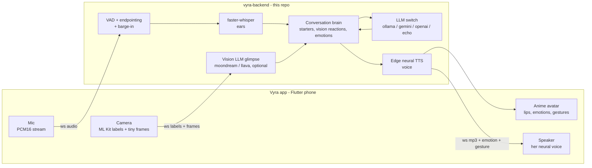
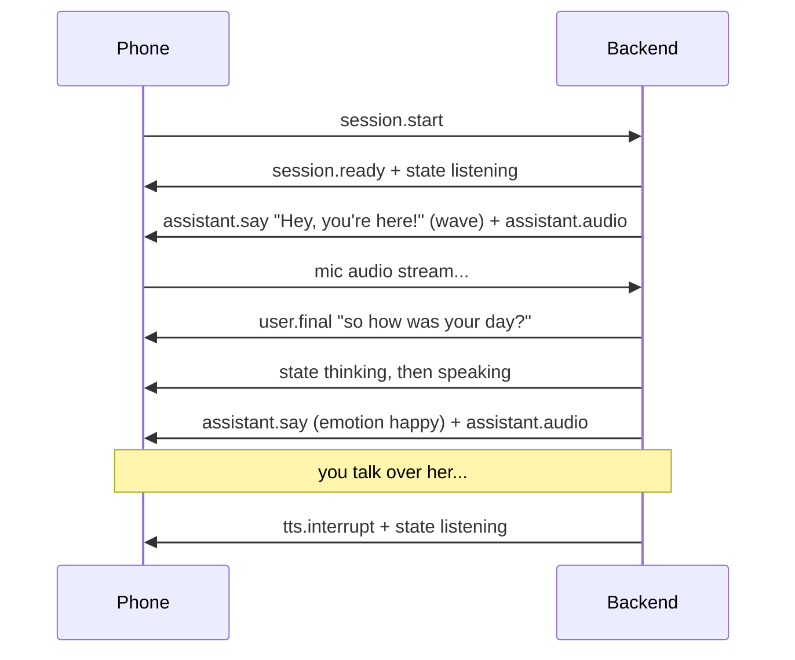

<div align="center">

# 🧠 vyra-backend

### The brain behind **[Vyra](https://github.com/chiragdhunna/vyra)** — an AI companion that talks, listens, sees, and feels like a friend.


<br/>

*Run this on the computer at your desk. Put your phone on the same Wi-Fi.*
*Vyra stops being "an app" and becomes **someone in the room**.*

</div>

---

## ✨ What she can do

| | Feature | How |
|---|---|---|
| 🗣️ | **Natural conversation** — she waits for you to finish, answers out loud, and you can **interrupt her mid-sentence** | server VAD + endpointing + barge-in |
| 🎙️ | **A real voice, not a robot** — neural female voice synthesized server-side | free Microsoft Edge neural voices |
| 👂 | **Streaming ears** — your mic streams continuously; no buttons, no turns | faster-whisper on your machine |
| 💬 | **She starts conversations** — opinionated mini-rants, callbacks to things *you* said, real questions, quick games | conversation-starter engine |
| 👁️ | **She notices you** — welcomes you back when you return, reacts to your smile, checks in when you look tired | on-device ML Kit labels |
| 🖼️ | **She can *see* the situation** *(optional)* — knows what you're holding, wearing, doing | local vision LLM (moondream/llava) |
| 🎭 | **Emotions & gestures** — every reply carries an emotion tag; she waves hello, laughs, stretches | `[emotion: X]` contract + gesture events |
| 🔒 | **Local-first & private** — run a local LLM, keep every word on your LAN; camera frames never leave your network | Ollama + LAN-only design |
| 🔁 | **One `.env` switch for the brain** — local ↔ cloud without touching code | provider factory |

---

## 🏗️ How it works



**Why a backend at all?** Three things a phone can't do alone: run a real local LLM (Ollama lives here), keep API keys out of the APK, and stream-listen *while speaking* so you can interrupt her like a real person (on-device speech recognizers are strictly turn-based).

---

## 🚀 Quickstart

### 1 — Run the backend (this machine)

```bash
git clone https://github.com/chiragdhunna/vyra-backend.git
cd vyra-backend
./run.sh          # venv → deps → .env → server on 0.0.0.0:8000
```

<details>
<summary>🪟 <b>Windows (manual steps)</b></summary>

```powershell
python -m venv .venv
.venv\Scripts\activate
pip install -r requirements.txt
pip install -r requirements-stt.txt   # streaming ears (recommended)
copy .env.example .env
python -m app.main
```
</details>

### 2 — Pick her brain (`.env`)

| Mode | Set | Needs |
|---|---|---|
| 🏠 **Local / private** *(default)* | `AI_PROVIDER=ollama` | [Ollama](https://ollama.com) + `ollama pull llama3.1` |
| ☁️ **Google Gemini** | `AI_PROVIDER=gemini` + `GEMINI_API_KEY` | [AI Studio key](https://aistudio.google.com/app/apikey) |
| ☁️ **OpenAI** | `AI_PROVIDER=openai` + `OPENAI_API_KEY` | OpenAI key |
| 🔌 **LM Studio / Groq / vLLM…** | `AI_PROVIDER=openai` + `OPENAI_BASE_URL` | any OpenAI-compatible server |
| 🧪 **Nothing (instant demo)** | `AI_PROVIDER=echo` | — |

> 💡 **First run?** Use `AI_PROVIDER=echo` to prove the whole phone ↔ PC loop in 60 seconds, then switch to `ollama`.

### 3 — Pair the phone

1. Phone and PC on the **same Wi-Fi**.
2. Find this machine's LAN IP → `ipconfig` (Windows) / `ip a` (Linux) / `ipconfig getifaddr en0` (macOS).
3. Allow TCP **8000** through the OS firewall.
4. In the **Vyra app's** `.env`: `VYRA_BACKEND_URL=http://<PC-IP>:8000`

✅ **Sanity check:** open `http://<PC-IP>:8000/healthz` in the phone's browser — you should see `{"status":"ok"}`.

---

## 🎙️ Her voice — neural, not robotic

Lines are synthesized **server-side** with free Microsoft Edge neural voices and streamed to the phone as MP3. If synthesis ever fails (offline machine, throttling), the phone silently falls back to device TTS *for that one line* — she never goes mute.

```env
TTS_PROVIDER=edge                  # edge | device
EDGE_TTS_VOICE=en-US-JennyNeural   # warm (default)
EDGE_TTS_RATE=+4%
EDGE_TTS_PITCH=+18Hz
```

| Voice | Character |
|---|---|
| `en-US-JennyNeural` | warm, friendly *(default)* |
| `en-US-AriaNeural` | expressive, lively |
| `en-US-AnaNeural` | younger, brighter |
| `en-GB-MaisieNeural` | British, young |

*Full catalog:* `edge-tts --list-voices`

---

## 💬 She starts conversations (not "how was your day?")

When you go quiet, the **starter engine** picks a mode — weighted, never the same twice in a row, with jittered + escalating spacing so it feels organic:

| Mode | What she does |
|---|---|
| 🔁 **Callback** | brings back something *you actually said* earlier |
| 🔥 **Rant** | a spontaneous opinionated mini-rant from 25 topic seeds — then asks your take |
| ❓ **Question** | a genuinely interesting question (favorites, dreams, hot takes) |
| 🎲 **Game** | would-you-rather / agree-or-disagree — she picks a side too |
| 💜 **Check-in** | the gentle "hey, you okay?" (lowest weight) |

**Honesty rule baked into every starter:** her opinions are hers — she never fabricates real-world news or invents shared memories.

---

## 👁️ Jarvis mode — she notices, and acts on it

Tiny on-device labels (presence · smile · eyes-open) flow in continuously. She reacts *situationally*, with cooldowns so she's observant, not creepy:

| You… | She… |
|---|---|
| step away 45s+ and come back | welcomes you back — waving 👋 |
| smile | notices and wonders what's up 😊 |
| look tired (heavy eyes, 15s sustained) | gently checks in — with a sleepy stretch 🥱 |
| ask her to "make an angry face" | plays along AND her face actually does it 😠 |

### 🖼️ Optional: actual sight

```bash
ollama pull moondream          # tiny & fast (or: llava)
# .env → VISION_LLM_MODEL=moondream
```

The phone then sends **one downscaled frame every ~20s**; the local model turns it into a one-line glimpse ("holding a red mug") that feeds her context — she *knows*, she doesn't narrate. **Frames never leave your LAN and are discarded after describing.**

---

## 🔌 API reference

### REST

| Endpoint | Purpose |
|---|---|
| `GET /healthz` | liveness (always open) |
| `GET /config` | active provider/model, STT mode, emotions |
| `POST /chat` | stateless chat: `{messages, user_name?, vision?}` → `{text, emotion, provider, model}` |
| `POST /chat/stream` | same, as SSE (`delta`… then `done`) |
| `GET /docs` | interactive OpenAPI |

<details>
<summary>📡 <b>WebSocket <code>/realtime</code> — full protocol</b></summary>

Text frames = JSON events. Binary frames = raw mic audio (PCM16 mono LE @ 16 kHz).

**Client → server**

| Event | Payload | Meaning |
|---|---|---|
| `session.start` | `user_name?, sample_rate, greet, client_stt` | begin a session (first frame) |
| *(binary)* | PCM16 @ 16 kHz | continuous mic audio |
| `vision.state` | `present, smiling, eyes_open` | on-device ML Kit labels |
| `vision.frame` | `jpeg_b64` | one downscaled glimpse frame |
| `user.text` | `text` | final transcript (client-STT mode) |
| `tts.state` | `playing` | phone's playback started / finished |
| `mic.state` | `muted` | user muted / unmuted |
| `ping` | | keepalive |

**Server → client**

| Event | Payload | Meaning |
|---|---|---|
| `session.ready` | `provider, model, stt, tts, vision_frames, vision_frame_interval` | capabilities handshake |
| `state` | `listening \| thinking \| speaking \| idle` | her state machine |
| `user.final` | `text` | what she heard (server STT) |
| `assistant.say` | `id, text, emotion, gesture, proactive` | speak this + animate |
| `assistant.audio` | `id, format, audio_b64` | her neural voice (empty = use device TTS) |
| `tts.interrupt` | `id` | **barge-in**: stop speaking NOW |
| `error` | `message` | non-fatal problem |
| `pong` | | keepalive reply |

**A session in one glance:**


</details>

<details>
<summary>⚙️ <b>Configuration reference — every <code>.env</code> knob</b></summary>

| Key | Default | Meaning |
|---|---|---|
| **Brain** | | |
| `AI_PROVIDER` | `ollama` | `ollama` · `gemini` · `openai` · `echo` |
| `OLLAMA_HOST` / `OLLAMA_MODEL` | `localhost:11434` / `llama3.1` | local model |
| `GEMINI_API_KEY` / `GEMINI_MODEL` | — / `gemini-2.5-flash` | Google cloud |
| `OPENAI_API_KEY` / `OPENAI_MODEL` / `OPENAI_BASE_URL` | — / `gpt-4o-mini` / api.openai.com | OpenAI-compatible |
| `LLM_TEMPERATURE` / `LLM_TIMEOUT_SECONDS` / `MAX_HISTORY_TURNS` | `0.9` / `120` / `24` | generation |
| **Server** | | |
| `HOST` / `PORT` | `0.0.0.0` / `8000` | listen on the LAN |
| `VYRA_API_KEY` | *(empty)* | optional shared secret (`X-Vyra-Key` / `?key=`) |
| **Voice** | | |
| `TTS_PROVIDER` | `edge` | `edge` (neural) · `device` |
| `EDGE_TTS_VOICE` / `RATE` / `PITCH` | `en-US-JennyNeural` / `+4%` / `+18Hz` | voice character |
| **Ears** | | |
| `STT_PROVIDER` | `whisper` | `whisper` · `client` |
| `WHISPER_MODEL` / `WHISPER_DEVICE` | `base.en` / `cpu` | ⚠️ `cpu` is the safe default — broken CUDA can hang |
| `STT_TIMEOUT_SECONDS` | `20` | a wedged native call can't freeze a session |
| `VAD_END_SILENCE_MS` | `700` | pause length that ends your turn |
| `VAD_START_MS` / `VAD_MIN_RMS` | `100` / `0.010` | speech detection |
| `BARGE_MIN_MS` | `300` | how long you must talk over her to interrupt |
| **Sight** | | |
| `VISION_LLM_MODEL` | *(empty = off)* | `moondream` · `llava` (via Ollama) |
| `VISION_FRAME_INTERVAL_SECONDS` | `20` | glimpse cadence |
| **Companionship** | | |
| `GREET_ON_CONNECT` / `GREETING_DELAY_SECONDS` | `true` / `3` | she says hi first |
| `PROACTIVE_IDLE_SECONDS` / `PROACTIVE_MAX_NUDGES` | `75` / `3` | starter pacing (jittered, escalating) |
| `VISION_REACTIONS` | `true` | Jarvis-mode reactions |
| `WELCOME_BACK_AFTER_SECONDS` / `VISION_REACT_COOLDOWN_SECONDS` | `45` / `90` | return + smile reactions |
| `TIRED_EYES_THRESHOLD` / `TIRED_AFTER_SECONDS` / `TIRED_REACT_COOLDOWN_SECONDS` | `0.4` / `15` / `600` | tired check-in |
</details>

---

## 🗂️ Project layout

```text
app/
├── main.py            FastAPI factory + uvicorn entrypoint
├── config.py          every .env knob, typed (pydantic-settings)
├── personality.py     Vyra's soul: system prompt + [emotion: X] contract
├── starters.py        conversation-starter engine (rants, callbacks, games…)
├── conversation.py    prompt assembly · history window · vision context
├── schemas.py         REST/WS models
├── providers/         one LLM contract → ollama · gemini · openai · echo
├── api/
│   ├── routes.py      /chat · /chat/stream · /config · /healthz
│   └── ws.py          /realtime endpoint
└── realtime/
    ├── vad.py         energy VAD + endpointing + barge-in mode
    ├── stt.py         faster-whisper (shared engine, GPU→CPU auto-fallback)
    ├── tts.py         Edge neural voice (per-line device fallback)
    ├── sight.py       vision-LLM glimpses (privacy-first)
    ├── session.py     the state machine that makes her feel alive
    └── protocol.py    event reference
tests/                 69 tests: unit → providers → REST/SSE → full WS voice loops
ci/ci.yml              GitHub Actions pipeline (see below)
```

---

## 🧪 Tests & CI

```bash
pip install -r requirements-dev.txt
pytest -q          # 69 tests, ~4s — no network, keys, or models needed
```

The suite drives the **entire realtime loop over a real websocket**: synthesized PCM in → VAD endpointing → (fake) STT → (echo) LLM → say/audio events out — plus barge-in, greetings, welcome-backs, tired check-ins, starter variety, hallucination filtering, provider wire-formats, SSE streaming, and auth.

**CI** (`ci/ci.yml`): pytest matrix (Python 3.11 + 3.13) on every **PR**, every **push to `main`**, and **manual dispatch** — plus a boot-and-REST smoke job that must pass before anything ships.

> ⚠️ **One-time setup:** the automation that built this repo couldn't write workflow files (GitHub token scope). Enable CI with:
> ```bash
> git mv ci/ci.yml .github/workflows/ci.yml && git commit -m "ci: enable workflow" && git push
> ```

---

## 🔧 Troubleshooting

| Symptom | Fix |
|---|---|
| Phone says "reaching my brain…" | same Wi-Fi? firewall port 8000? test `http://<PC-IP>:8000/healthz` in the phone browser |
| "couldn't reach my brain" spoken aloud | the LLM hop failed — `ollama list` (is the model pulled?), or check the key. Logs now say exactly why |
| She can't hear you | install ears: `pip install -r requirements-stt.txt`; keep `WHISPER_DEVICE=cpu` |
| Robotic voice | `TTS_PROVIDER=edge` needs internet on the PC; check logs for `edge-tts failed` |
| She mis-hears words | try `WHISPER_MODEL=small.en` (better accuracy, still CPU-realtime on most machines) |
| Cuts you off / waits too long | tune `VAD_END_SILENCE_MS` (higher = more patience) |

Every turn is narrated in the logs: `heard (2.3s): '…'` → `llm raw (95 chars): '…'` — one glance tells you which hop misbehaved.

---

## 🗺️ Roadmap

- [x] LLM switch (local Ollama ↔ cloud) via `.env`
- [x] Realtime voice loop: VAD, streaming ears, **barge-in**
- [x] Neural voice (Edge TTS, per-line fallback)
- [x] Conversation starters: rants · callbacks · questions · games
- [x] Jarvis mode: welcome-back · smile · tired reactions (+ optional vision LLM sight)
- [x] Emotions + gestures (`wave`, `laugh`, `stretch`, `lean`)
- [ ] Long-term memory across sessions
- [ ] Fully-local neural TTS (Piper / Kokoro)
- [ ] Wake-word ("Vyra?")

---

<div align="center">

**Companion app:** [github.com/chiragdhunna/vyra](https://github.com/chiragdhunna/vyra) 📱

*Built to make a phone on a desk feel like someone in the room.* 💜

</div>
